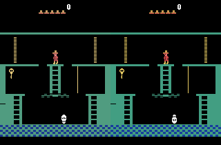
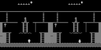

### Subtle difference between Atari Grand Challange and Openai Gym Atari colours

There is a subtle difference in colors between Atari Grand Challange
and OpenAI gym.

Atari Grand Challange is an openly accesible collection of behavioural cloning data gathered from various Atari games.
OpenAI gym is, among others, wrapper around the same games.
Turns out that the images are not the same! They have differences that changes outputs of neural nets, but are not perceptible by bare eye.

Here's the comparison:



See? No difference, right?

After typical processing:




The difference is subtle but noticeable.

The list of colors are as follows
```
colors in agc        = [(0, 0, 0), (28, 56, 144), (80, 156, 128), (192, 88, 88), (208, 180, 108), (224, 136, 136), (232, 204, 124), (244, 244, 244)]

colors in openai gym = [(0, 0, 0), (24, 59, 157), (66, 158, 130), (200, 72, 72), (210, 182, 86), (228, 111, 111), (232, 204, 99), (236, 236, 236)]
```
